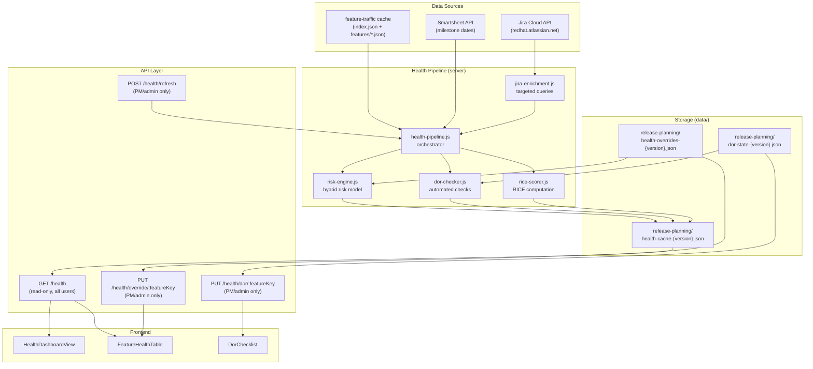

# Release Health: Implementation Plan

**Author:** Architect Agent
**Date:** 2026-04-26
**Status:** Revised (review findings addressed)
**Module:** `release-planning` (existing)
**Audience:** Implementing agents, lead engineer, DevOps

---

## 1. Executive Summary

### What We Are Building

A new **Release Health** capability within the existing `release-planning` module that provides:

1. **Risk assessment** -- a hybrid model combining release-pulse's phase-aware milestone tracking with release-analysis's velocity-based risk scoring, applied per-feature and per-release.
2. **Definition of Ready (DoR) checklist** -- a full readiness checker for each feature, combining automated Jira-derived checks (target version set, PM assigned, etc.) with manual toggles for non-automatable items (architectural alignment, licensing review, cross-functional engagement). Persisted per-feature per-release.
3. **RICE scoring** -- reads Reach, Impact, Confidence, and Effort from Jira custom fields on RHAISTRAT features and surfaces a computed RICE score alongside each feature.
4. **Health dashboard** -- a read-only view available to all authenticated users showing release-level and feature-level health, risk flags, DoR completion rates, and RICE-prioritized feature lists. Edit capabilities (checklist toggles, manual overrides) restricted to PMs and admins.

### Why

The operational proposal (`design/2026-04-22-release-planning-proposal.md`) identified three systemic issues: late descoping due to unvalidated commitments, lack of execution visibility, and quality gaps from unenforced DoR. This implementation plan delivers the tooling layer for the Planning domain's Refinement and Capacity Validation phases. It gives PMs a single view to answer "is this release healthy?" and "is each feature ready?" -- replacing tribal knowledge and manual spreadsheet tracking.

### Design Principles

- **Extend, don't fork.** New capability lives inside `release-planning`, reusing its per-release config, PM auth, audit log, and storage patterns.
- **Hybrid data model.** Feature-traffic cache provides baseline data (completion %, epic counts, health, blockers). Targeted Jira queries supplement with risk-specific fields not in the cache (changelog, description presence, story points, dependency links).
- **Progressive enhancement.** Each phase delivers a usable increment. Phase 1 (data pipeline) works without the frontend. Phase 3 (frontend) works with cached data even if Jira is unavailable.
- **Read-default, edit-gated.** All authenticated users see the health dashboard. Only PMs/admins can toggle DoR checks or save manual overrides.

---

## 2. Architecture Overview

### 2.1 Module Structure (Extended)

The new capability adds server and client files to the existing `release-planning` module. No new module is created.

```
modules/release-planning/
  module.json                          # MODIFIED -- add navItems
  server/
    index.js                           # MODIFIED -- register new routes
    config.js                          # MODIFIED -- add health config fields
    constants.js                       # MODIFIED -- add health-related constants
    health/
      risk-engine.js                   # NEW -- hybrid risk assessment engine
      dor-checker.js                   # NEW -- automated DoR checks
      jira-enrichment.js              # NEW -- targeted Jira queries for risk fields
      rice-scorer.js                   # NEW -- RICE score computation
      health-pipeline.js              # NEW -- orchestrates enrichment + risk + DoR
    audit-log.js                       # REUSED -- health actions logged here
    pm-auth.js                         # REUSED -- edit gating
    config-lock.js                     # REUSED -- serialized writes
  client/
    index.js                           # MODIFIED -- add health view route
    views/
      HealthDashboardView.vue          # NEW -- main health dashboard
    components/
      HealthSummaryCards.vue            # NEW -- release-level health summary
      FeatureHealthTable.vue           # NEW -- per-feature health + DoR status
      FeatureHealthRow.vue             # NEW -- expandable row with DoR checklist
      DorChecklist.vue                 # NEW -- interactive checklist component
      RiskBadge.vue                    # NEW -- risk level indicator (green/yellow/red)
      RiceScoreDisplay.vue             # NEW -- RICE score breakdown
      HealthFilterBar.vue              # NEW -- filters for health view
      MilestoneTimeline.vue            # NEW -- visual timeline from Smartsheet
    composables/
      useReleaseHealth.js              # NEW -- health data fetching + state
      useDorChecklist.js               # NEW -- checklist state + save logic
  __tests__/
    server/
      risk-engine.test.js              # NEW
      dor-checker.test.js              # NEW
      jira-enrichment.test.js          # NEW
      rice-scorer.test.js              # NEW
      health-pipeline.test.js          # NEW
      health-routes.test.js            # NEW
    client/
      health-components.test.js        # NEW
```

### 2.2 Data Flow Diagram



### 2.3 Data Source Strategy

**From feature-traffic index (`index.json`) -- lightweight, no I/O per feature:**
- `key`, `summary` -- feature identity/title (F-1 partial)
- `status`, `statusCategory` -- workflow state
- `targetVersions` -- target release version (F-2)
- `assignee` -- delivery owner (F-5, string in index)
- `fixVersions` -- committed fix version
- `completionPct`, `epicCount`, `issueCount`, `blockerCount`, `health` -- progress metrics
- `parentKey` -- outcome/Big Rock linkage

**From feature-traffic detail files (`features/*.json`) -- loaded via `loadFeatureDetail()`:**
- `pm` -- product manager (F-4, object with `displayName` in detail files; NOT reliably present in index)
- `components` -- team/component assignment (F-6, only in detail files)
- `releaseType` -- DP/TP/GA phase (F-10, only in detail files)
- `issueLinks` -- RFE linkage
- `labels` -- candidate labels (array, not stringified)

> **I/O cost note:** The health pipeline must call `loadFeatureDetail()` for each feature to access `pm`, `components`, `releaseType`, and `labels`. For a release with 100+ features, this means 100+ file reads from `data/feature-traffic/features/`. This is a synchronous filesystem read per feature (via `readFromStorage`), which is acceptable for server-side use -- the same pattern is already used by `cache-reader.js` lines 174, 262, and 315 during the existing candidates pipeline. The detail files are typically 2-5 KB each.

**From targeted Jira enrichment (batched queries):**
- `description` presence -- non-empty check for F-1 (ADF field; check length > 0)
- `customfield_10028` (story points) -- estimated scope (F-7)
- `issuelinks` full list -- dependency identification (F-8)
- `customfield_10855` changelog -- refinement history (when was target version set?)
- RICE custom fields on RHAISTRAT parent features:
  - Reach (`customfield_XXXXX` -- to be confirmed via Jira field discovery)
  - Impact (`customfield_XXXXX`)
  - Confidence (`customfield_XXXXX`)
  - Effort (`customfield_XXXXX`)

**From Smartsheet (via shared/server/smartsheet.js):**
- EA1/EA2/GA milestone dates for timeline display and days-remaining calculations
- Freeze dates (EA1 code freeze, EA2 code freeze, GA code freeze) for risk engine phase checks

> **Implementation note:** The existing `discoverReleases()` function (lines 142-149) only returns `{ version, ea1Target, ea2Target, gaTarget }` -- the freeze dates are parsed internally but discarded in the final `.map()`. A new `discoverReleasesWithFreezes()` function must be added to `shared/server/smartsheet.js` that returns all 6 milestones: `{ version, ea1Freeze, ea1Target, ea2Freeze, ea2Target, gaFreeze, gaTarget }`. The health pipeline will call this function instead of `discoverReleases()`. The existing `discoverReleases()` is left unchanged for backward compatibility.

---

## 3. Implementation Phases

### Phase 1: Data Pipeline (Jira Enrichment + Risk Engine)

**Goal:** Server-side pipeline that produces a health assessment for each feature in a release, persisted as a cache file.

**Estimated effort:** 3 sprints (this module has zero Jira integration today -- all Jira enrichment, the two-pass strategy, and rate limit coordination are net-new infrastructure)

#### 1a. Jira Enrichment Module (`server/health/jira-enrichment.js`)

Targeted Jira queries to supplement feature-traffic cache data. Uses the existing `shared/server/jira.js` client (Basic auth, rate limiting, retry).

```javascript
// Enrichment fields fetched per batch of feature keys (lightweight -- Pass 1)
const ENRICHMENT_FIELDS = [
  'description',           // F-1: non-empty check
  'customfield_10028',     // F-7: story points
  'issuelinks'             // F-8: dependency links
].join(',')

// Separate query for RICE fields on RHAISTRAT parent issues
const RICE_FIELDS = [
  'customfield_XXXXX',     // Reach (TBD -- discovery needed)
  'customfield_XXXXX',     // Impact
  'customfield_XXXXX',     // Confidence
  'customfield_XXXXX'      // Effort
].join(',')

// Changelog fields -- fetched ONLY for features needing refinement history (Pass 2)
// NOTE: changelog data requires the `expand` parameter, NOT a fields entry.
// See shared/server/jira.js fetchAllJqlResults() which accepts { expand: 'changelog' }.
// Pattern from person-metrics.js line 380:
//   fetchAllJqlResults(jiraRequest, jql, FIELDS, { expand: 'changelog' })
const CHANGELOG_FIELDS = 'summary'  // minimal fields; changelog comes via expand
```

**Two-pass enrichment strategy (addresses memory and rate limiting):**

- **Pass 1 (lightweight, all features):** Fetch `ENRICHMENT_FIELDS` for all features in batches of 40. Uses `fetchAllJqlResults(jiraRequest, jql, ENRICHMENT_FIELDS)` without changelog expansion. This provides description, story points, and issue links for every feature.
- **Pass 2 (changelog, targeted subset):** Fetch changelog ONLY for features flagged as potentially risky by Pass 1 -- specifically features that lack a Target Version, are in early workflow states (e.g., "New", "Refinement"), or were flagged with VELOCITY_LAG. Uses `fetchAllJqlResults(jiraRequest, jql, CHANGELOG_FIELDS, { expand: 'changelog' })`. This reduces memory consumption and API cost vs. fetching changelog for all 100+ features.
- **Batching:** Group feature keys into batches of 40 (matching release-analysis's pattern). Use JQL `key in (KEY-1, KEY-2, ...)` with `fetchAllJqlResults()`. Include 1-second throttle between batches (matching `JIRA_THROTTLE_MS`).
- **RICE fields:** Separate query for unique `parentKey` values (RHAISTRAT outcomes).

**Output:** Map of `featureKey -> enrichmentData`:
```javascript
{
  "RHAISTRAT-123": {
    // From Pass 1 (all features):
    hasDescription: true,
    storyPoints: 8,
    dependencyLinks: [
      { type: "Blocks", direction: "inward", linkedKey: "RHAISTRAT-456", linkedStatus: "In Progress" }
    ],
    // From Pass 2 (only for features needing refinement history -- may be null):
    refinementHistory: [
      { field: "Target Version", from: null, to: "rhoai-3.5", date: "2026-03-15" }
    ],
    // From RICE query (only if enableRice is true and field IDs configured):
    rice: { reach: 500, impact: 3, confidence: 80, effort: 2 }
  }
}
```

#### 1b. Risk Engine (`server/health/risk-engine.js`)

Hybrid risk model combining:

**Category 1: Milestone Risk (from release-pulse)**
- Compare current date against SmartSheet milestones (EA1 freeze, EA2 freeze, GA freeze)
- Flag features whose status does not match the expected phase progress
- Example: feature still in "Refinement" after EA1 code freeze date = RED

**Category 2: Velocity Risk (from release-analysis)**
- Uses `completionPct`, `issueCount`, and days-remaining to assess pace
- Adapts `releaseRiskFromIncompleteAndTime()` pattern from release-analysis
- Per-feature rather than per-release aggregation

**Category 3: Readiness Risk (from DoR checker)**
- Percentage of DoR items satisfied
- Features with < 50% DoR completion = RED, 50-80% = YELLOW, > 80% = GREEN

**Category 4: Dependency Risk**
- Features with unresolved blocking dependencies (status != Done/Closed)
- Features blocked by items outside the release scope

**Category 5: Scope Risk**
- Features with no story points estimate
- Features with no RFE linkage (customer-facing features without business justification)

**Composite risk score:**
```javascript
function computeFeatureRisk(feature, milestones, dorStatus, enrichment) {
  const flags = []

  // Milestone risk
  const phase = determineExpectedPhase(milestones, new Date())
  if (isFeatureBehindPhase(feature, phase)) {
    flags.push({ category: 'MILESTONE_MISS', severity: 'high',
      message: `Feature still in "${feature.status}" but ${phase} code freeze has passed` })
  }

  // Velocity risk
  if (feature.completionPct < expectedCompletionForPhase(phase)) {
    flags.push({ category: 'VELOCITY_LAG', severity: feature.completionPct < 25 ? 'high' : 'medium',
      message: `${feature.completionPct}% complete, expected ${expectedCompletionForPhase(phase)}% by now` })
  }

  // DoR readiness
  const dorPct = dorStatus.checkedCount / dorStatus.totalCount * 100
  if (dorPct < 50) {
    flags.push({ category: 'DOR_INCOMPLETE', severity: 'high',
      message: `Only ${Math.round(dorPct)}% of DoR criteria met` })
  } else if (dorPct < 80) {
    flags.push({ category: 'DOR_INCOMPLETE', severity: 'medium',
      message: `${Math.round(dorPct)}% of DoR criteria met (target: 80%)` })
  }

  // Dependency risk
  const blocking = (enrichment.dependencyLinks || [])
    .filter(d => d.direction === 'inward' && d.type === 'Blocks' && !CLOSED_STATUSES.includes(d.linkedStatus))
  if (blocking.length > 0) {
    flags.push({ category: 'BLOCKED', severity: 'high',
      message: `Blocked by ${blocking.length} unresolved issue(s): ${blocking.map(b => b.linkedKey).join(', ')}` })
  }

  // Scope risk
  if (!enrichment.storyPoints) {
    flags.push({ category: 'UNESTIMATED', severity: 'medium',
      message: 'No story point estimate' })
  }

  const severity = flags.some(f => f.severity === 'high') ? 'red'
    : flags.some(f => f.severity === 'medium') ? 'yellow' : 'green'

  return { risk: severity, flags, riskScore: flags.length }
}
```

#### 1c. RICE Scorer (`server/health/rice-scorer.js`)

```javascript
// RICE = (Reach * Impact * Confidence%) / Effort
function computeRiceScore(rice) {
  if (!rice || !rice.reach || !rice.impact || !rice.confidence || !rice.effort) {
    return null  // Incomplete RICE data
  }
  const confidence = rice.confidence / 100  // Convert from percentage
  return Math.round((rice.reach * rice.impact * confidence) / rice.effort)
}
```

RICE fields are read from the RHAISTRAT parent feature (outcome key). The field IDs must be discovered and configured before RICE scoring can be enabled.

**RICE field discovery process:**

1. **Admin action via Settings UI:** The release-planning Settings panel will include a "Discover RICE Fields" button that calls a new admin-only endpoint `GET /releases/rice-fields/discover`. This endpoint calls `/rest/api/3/field` on the Jira instance, filters for custom fields matching common RICE naming patterns (e.g., "Reach", "Impact", "Confidence", "Effort", "RICE"), and returns the matching field names and IDs for the admin to select.
2. **Manual fallback:** If automatic discovery does not find matching fields (e.g., custom field names differ from expected patterns), the admin can manually enter field IDs in the config form. The Settings UI provides text inputs for each of the four RICE field IDs under `customFieldIds`.
3. **Graceful degradation:** If RICE field IDs are not configured (`enableRice: false` or empty field IDs), the RICE scorer module returns `null` for all features. The `RiceScoreDisplay` component shows "N/A" with a tooltip "RICE scoring not configured". No errors are thrown -- RICE is treated as an optional enhancement.
4. **Validation:** When an admin saves RICE field IDs, the backend validates them by making a single Jira API call to verify the fields exist on a sample RHAISTRAT issue. Invalid field IDs are rejected with a descriptive error message.

### Phase 2: Backend API Endpoints

**Goal:** REST endpoints for health data access and DoR state management.

**Estimated effort:** 1 sprint

All routes are registered in the existing `server/index.js` via a sub-router pattern to keep the file manageable. The function signature matches the standard module pattern (`registerRoutes(router, context)` in `server/index.js` line 23):

```javascript
// In server/index.js — mount health routes
const healthRoutes = require('./health/health-routes')
healthRoutes(router, context)
// Access storage via context: const { readFromStorage, writeToStorage } = context.storage
// Access auth via context: const { requireAuth, requireAdmin } = context
```

#### New Endpoints

**Read (all authenticated users):**

| Method | Path | Description |
|--------|------|-------------|
| `GET` | `/releases/:version/health` | Full health assessment for a release |
| `GET` | `/releases/:version/health/summary` | Aggregate health summary (counts by risk level, DoR completion rate) |
| `GET` | `/releases/:version/health/feature/:key` | Single feature health detail |

**Write (PM/admin only):**

| Method | Path | Description |
|--------|------|-------------|
| `PUT` | `/releases/:version/health/dor/:featureKey` | Update DoR checklist state for a feature |
| `PUT` | `/releases/:version/health/override/:featureKey` | Set manual risk override for a feature |
| `POST` | `/releases/:version/health/refresh` | Trigger health pipeline refresh |
| `GET` | `/releases/:version/health/refresh/status` | Poll refresh status |

#### Request/Response Shapes

**GET `/releases/:version/health`**

```json
{
  "version": "3.5",
  "generatedAt": "2026-04-26T12:00:00Z",
  "milestones": {
    "ea1Freeze": "2026-05-15",
    "ea1Target": "2026-06-01",
    "ea2Freeze": "2026-07-15",
    "ea2Target": "2026-08-01",
    "gaFreeze": "2026-09-15",
    "gaTarget": "2026-10-01"
  },
  "summary": {
    "totalFeatures": 45,
    "byRisk": { "green": 28, "yellow": 12, "red": 5 },
    "dorCompletionRate": 72,
    "averageRiceScore": 340,
    "blockedCount": 3,
    "unestimatedCount": 8,
    "currentPhase": "EA1",
    "daysToNextMilestone": 19,
    "nextMilestone": "EA1 Code Freeze"
  },
  "features": [
    {
      "key": "RHAISTRAT-123",
      "summary": "Feature title",
      "status": "In Progress",
      "priority": "Major",
      "phase": "GA",
      "bigRock": "Model Serving Improvements",
      "tier": 1,
      "pm": "Jane Smith",
      "deliveryOwner": "Bob Jones",
      "components": "Model Serving",
      "completionPct": 65,
      "epicCount": 3,
      "issueCount": 24,
      "blockerCount": 1,
      "health": "YELLOW",
      "risk": {
        "level": "yellow",
        "score": 2,
        "flags": [
          { "category": "VELOCITY_LAG", "severity": "medium", "message": "65% complete, expected 80% by now" },
          { "category": "DOR_INCOMPLETE", "severity": "medium", "message": "70% of DoR criteria met (target: 80%)" }
        ]
      },
      "dor": {
        "checkedCount": 7,
        "totalCount": 10,
        "completionPct": 70,
        "items": [
          { "id": "F-1", "label": "Clear title and description", "type": "automated", "checked": true, "source": "jira" },
          { "id": "F-2", "label": "Target release version set", "type": "automated", "checked": true, "source": "index" },
          { "id": "F-3", "label": "Acceptance criteria defined", "type": "manual", "checked": false, "source": "manual" },
          { "id": "F-4", "label": "PM assigned", "type": "automated", "checked": true, "source": "detail" },
          { "id": "F-5", "label": "Delivery owner assigned", "type": "automated", "checked": true, "source": "index" },
          { "id": "F-6", "label": "Component/team assignment", "type": "automated", "checked": true, "source": "detail" },
          { "id": "F-7", "label": "Estimated scope (story points)", "type": "automated", "checked": true, "source": "jira" },
          { "id": "F-8", "label": "No unresolved blocking dependencies", "type": "automated", "checked": true, "source": "jira" },
          { "id": "F-9", "label": "RFE linkage (if customer-driven)", "type": "manual", "checked": true, "source": "manual" },
          { "id": "F-10", "label": "Release type/phase specified", "type": "automated", "checked": true, "source": "detail" },
          { "id": "F-11", "label": "Architectural alignment reviewed", "type": "manual", "checked": false, "source": "manual" },
          { "id": "F-12", "label": "Cross-functional engagement confirmed", "type": "manual", "checked": false, "source": "manual" },
          { "id": "F-13", "label": "Licensing review complete", "type": "manual", "checked": false, "source": "manual" }
        ]
      },
      "rice": {
        "reach": 500,
        "impact": 3,
        "confidence": 80,
        "effort": 2,
        "score": 600
      },
      "jiraUrl": "https://redhat.atlassian.net/browse/RHAISTRAT-123"
    }
  ],
  "_cacheStale": false,
  "_refreshing": false
}
```

**PUT `/releases/:version/health/dor/:featureKey`**

Request:
```json
{
  "items": {
    "F-3": true,
    "F-11": false
  },
  "notes": "Acceptance criteria documented in linked Google Doc"
}
```

Response:
```json
{
  "featureKey": "RHAISTRAT-123",
  "dor": { "checkedCount": 8, "totalCount": 13, "completionPct": 62 },
  "updatedAt": "2026-04-26T12:30:00Z",
  "updatedBy": "jane@redhat.com"
}
```

**PUT `/releases/:version/health/override/:featureKey`**

Request:
```json
{
  "riskOverride": "green",
  "reason": "Team confirmed they can absorb the remaining work before EA2"
}
```

Response:
```json
{
  "featureKey": "RHAISTRAT-123",
  "riskOverride": "green",
  "reason": "Team confirmed they can absorb the remaining work before EA2",
  "updatedAt": "2026-04-26T12:35:00Z",
  "updatedBy": "jane@redhat.com"
}
```

### Phase 3: Frontend Views

**Goal:** Health dashboard with interactive DoR checklist.

**Estimated effort:** 2-3 sprints

**Recommendation:** Spawn a UX teammate agent for this phase. The health dashboard involves significant data visualization (risk heatmaps, milestone timelines, DoR progress indicators) and interaction design (expandable rows, inline editing, filter combinations) that benefits from dedicated frontend attention.

#### 3a. Navigation

Update `module.json` to add a new nav item:

```json
{
  "navItems": [
    { "id": "main", "label": "Big Rocks Planning", "icon": "ClipboardList", "default": true },
    { "id": "health", "label": "Release Health", "icon": "HeartPulse" },
    { "id": "audit-log", "label": "Audit Log", "icon": "History" }
  ]
}
```

Update `client/index.js` to register the route:

```javascript
export const routes = {
  'main': defineAsyncComponent(() => import('./views/DashboardView.vue')),
  'health': defineAsyncComponent(() => import('./views/HealthDashboardView.vue')),
  'audit-log': defineAsyncComponent(() => import('./views/AuditLogView.vue')),
}
```

#### 3b. Health Dashboard View (`HealthDashboardView.vue`)

**Layout:**

```
+---------------------------------------------------------------+
| Release Health Dashboard                    [Release v3.5 v]   |
| Data from 2026-04-26 12:00        [Refresh] [Export]          |
+---------------------------------------------------------------+
| +----------------------------------------------------------+  |
| | Milestone Timeline (MilestoneTimeline.vue)                |  |
| | EA1 Freeze ---- EA1 Release ---- EA2 Freeze ---- GA      |  |
| |     May 15         Jun 1           Jul 15      Oct 1      |  |
| |              ^ We are here (19 days to EA1 freeze)        |  |
| +----------------------------------------------------------+  |
|                                                               |
| +----------+ +----------+ +----------+ +----------+          |
| | GREEN 28 | | YELLOW 12| | RED 5    | | DoR 72%  |          |
| | features | | features | | features | | complete |          |
| +----------+ +----------+ +----------+ +----------+          |
|                                                               |
| [Risk v] [DoR v] [Big Rock v] [Component v] [Search ____]    |
|                                                               |
| Feature Health Table                                          |
| +---+----------+--------+------+-----+------+------+-------+ |
| |   | Feature  | Status | Risk | DoR | RICE | Comp | Phase | |
| +---+----------+--------+------+-----+------+------+-------+ |
| | > | STRAT-123| In Prog| YEL  | 7/10| 600  | MS   | GA    | |
| |   +----------------------------------------------------------+
| |   | DoR Checklist (expandable)                               |
| |   | [x] Clear title and description  (auto)                 |
| |   | [x] Target release version set   (auto)                 |
| |   | [ ] Acceptance criteria defined  (manual) [toggle]      |
| |   | ...                                                      |
| |   | Risk Flags:                                              |
| |   |   VELOCITY_LAG: 65% complete, expected 80%              |
| |   |   DOR_INCOMPLETE: 70% of DoR met                        |
| |   +----------------------------------------------------------+
| | > | STRAT-456| Review | GRN  | 9/10| 340  | Pipeline| TP  | |
| +---+----------+--------+------+-----+------+------+-------+ |
+---------------------------------------------------------------+
```

**Key interactions:**
- Release selector reuses existing `ReleaseSelector.vue`
- Clicking a row expands to show full DoR checklist and risk flags
- Manual DoR items have toggles (disabled for non-PM users)
- Risk level column shows colored badge (reuses StatusBadge pattern)
- Sortable by any column; filterable by risk level, DoR status, Big Rock, component
- Export to CSV/Markdown (extends existing export pattern)

#### 3c. Composable (`useReleaseHealth.js`)

```javascript
import { ref } from 'vue'
import { apiRequest } from '@shared/client/services/api'

const API_BASE = '/modules/release-planning'

const healthData = ref(null)
const healthLoading = ref(false)
const healthError = ref(null)
const healthRefreshing = ref(false)

export function useReleaseHealth() {
  async function loadHealth(version) { /* ... */ }
  async function updateDorItem(version, featureKey, items, notes) { /* ... */ }
  async function setRiskOverride(version, featureKey, level, reason) { /* ... */ }
  async function triggerHealthRefresh(version) { /* ... */ }
  async function checkHealthRefreshStatus(version) { /* ... */ }

  return {
    healthData, healthLoading, healthError, healthRefreshing,
    loadHealth, updateDorItem, setRiskOverride,
    triggerHealthRefresh, checkHealthRefreshStatus
  }
}
```

### Phase 4: Integration with Big Rocks and Feature-Traffic

**Goal:** Cross-link health data with existing Big Rocks table and feature-traffic module.

**Estimated effort:** 1 sprint

- **Big Rocks table enrichment:** Add a "Health" column to the existing `BigRocksTable.vue` showing aggregate risk for each Big Rock (worst-case risk across its features).
- **Feature table enrichment:** Add DoR completion % and risk badge columns to existing `FeaturesTable.vue`.
- **Cross-navigation:** Click a feature in the health dashboard to navigate to its detail in feature-traffic (`#/feature-traffic/detail?key=RHAISTRAT-123`). Click a Big Rock in the health dashboard to filter the Big Rocks planning view.
- **Summary cards:** Extend existing `SummaryCards.vue` with a health indicator when health data is available.

### Phase 5: Polish, Testing, Deployment

**Goal:** Comprehensive tests, demo mode support, deployment validation.

**Estimated effort:** 1 sprint

- Unit tests for all server modules (risk-engine, dor-checker, jira-enrichment, rice-scorer, health-pipeline)
- Route integration tests (following existing `routes.test.js` pattern)
- Component tests for health dashboard views
- Demo mode support: fixture data for health cache, DoR state
- CI validation: kustomize overlay check (no deploy changes expected since this is an existing module)
- Performance testing: health pipeline with 100+ features

---

## 4. Data Model

### 4.1 Feature Readiness State (Persisted)

**Storage path:** `release-planning/dor-state-{version}.json`

```json
{
  "version": "3.5",
  "updatedAt": "2026-04-26T12:30:00Z",
  "features": {
    "RHAISTRAT-123": {
      "manualChecks": {
        "F-3": { "checked": true, "updatedBy": "jane@redhat.com", "updatedAt": "2026-04-26T12:30:00Z" },
        "F-9": { "checked": true, "updatedBy": "jane@redhat.com", "updatedAt": "2026-04-25T10:00:00Z" },
        "F-11": { "checked": false, "updatedBy": null, "updatedAt": null },
        "F-12": { "checked": false, "updatedBy": null, "updatedAt": null },
        "F-13": { "checked": false, "updatedBy": null, "updatedAt": null }
      },
      "notes": "Acceptance criteria in linked Google Doc RHOAI-Feature-Spec-123"
    }
  }
}
```

### 4.2 DoR Checklist Items

**Definition (constant, in `server/health/dor-checker.js`):**

```javascript
const DOR_ITEMS = [
  // Automated checks -- derived from index, detail files, or Jira enrichment
  { id: 'F-1',  label: 'Clear title and description',         type: 'automated', source: 'jira',    check: (f, e) => !!f.summary && e.hasDescription },
  { id: 'F-2',  label: 'Target release version set',          type: 'automated', source: 'index',   check: (f) => !!f.targetRelease },
  { id: 'F-4',  label: 'PM assigned',                         type: 'automated', source: 'detail',  check: (f) => !!f.pm },
  { id: 'F-5',  label: 'Delivery owner assigned',             type: 'automated', source: 'index',   check: (f) => !!f.deliveryOwner },
  { id: 'F-6',  label: 'Component/team assignment',           type: 'automated', source: 'detail',  check: (f) => f.components && f.components.length > 0 },
  { id: 'F-7',  label: 'Estimated scope (story points)',      type: 'automated', source: 'jira',    check: (f, e) => e.storyPoints > 0 },
  { id: 'F-8',  label: 'No unresolved blocking dependencies',  type: 'automated', source: 'jira',
    // Pass by default. Fails ONLY if there are inward "Blocks" links with a non-closed status.
    // Rationale: most features have no blocking dependencies, and there is no "no-dependencies"
    // label convention in this codebase. Checking for the absence of unresolved blockers is
    // more useful than checking for the presence of any dependency link.
    check: (f, e) => {
      const blocking = (e.dependencyLinks || []).filter(d =>
        d.direction === 'inward' && d.type === 'Blocks' && !CLOSED_STATUSES.includes(d.linkedStatus))
      return blocking.length === 0
    }
  },
  { id: 'F-10', label: 'Release type/phase specified',        type: 'automated', source: 'detail', check: (f) => !!f.phase },

  // Manual checks -- toggled by PM in the UI
  { id: 'F-3',  label: 'Acceptance criteria defined',                type: 'manual', source: 'manual' },
  { id: 'F-9',  label: 'RFE linkage (if customer-driven)',           type: 'manual', source: 'manual' },
  { id: 'F-11', label: 'Architectural alignment reviewed',           type: 'manual', source: 'manual' },
  { id: 'F-12', label: 'Cross-functional engagement confirmed',      type: 'manual', source: 'manual' },
  { id: 'F-13', label: 'Licensing review complete',                  type: 'manual', source: 'manual' }
]
```

**Runtime evaluation:**

For each feature, automated checks are evaluated against the feature-traffic data and Jira enrichment data. Manual checks are read from the persisted DoR state file.

> **Important:** DoR checks must operate on raw feature data from `loadIndex()` and `loadFeatureDetail()`, NOT on `mapToCandidate()` output. The `mapToCandidate()` function in `cache-reader.js` stringifies labels via `labels.join(', ')` (line 111) and components via `components.join(', ')` (line 110), which breaks array methods like `labels.includes()`. The health pipeline should use the raw `labels` array from detail files and the raw `components` array for reliable field checks.

The combined result is:

```javascript
{
  checkedCount: 7,
  totalCount: 13,
  completionPct: 54,
  items: [
    { id: 'F-1', label: '...', type: 'automated', checked: true, source: 'jira' },
    // ... all 13 items with their checked status
  ]
}
```

### 4.3 RICE Score Model

```javascript
// Stored as part of health cache, computed from Jira custom fields
{
  "rice": {
    "reach": 500,       // Number of users/quarter affected
    "impact": 3,        // 0.25 (minimal), 0.5 (low), 1 (medium), 2 (high), 3 (massive)
    "confidence": 80,   // Percentage (0-100)
    "effort": 2,        // Person-months
    "score": 600,       // Computed: (500 * 3 * 0.80) / 2 = 600
    "complete": true     // Whether all 4 input fields are populated
  }
}
```

**Config fields (added to `release-planning/config.json`):**

```javascript
{
  // ... existing fields ...
  "customFieldIds": {
    // ... existing fields ...
    "riceReach": "",        // customfield_XXXXX -- discovered via /rest/api/3/field
    "riceImpact": "",       // customfield_XXXXX
    "riceConfidence": "",   // customfield_XXXXX
    "riceEffort": ""        // customfield_XXXXX
  },
  "healthConfig": {
    "enableRice": false,            // Toggle RICE scoring (disabled until field IDs confirmed)
    "enableJiraEnrichment": true,   // Toggle Jira enrichment queries
    "enrichmentBatchSize": 40,      // Keys per Jira batch query
    "enrichmentThrottleMs": 1000,   // Delay between batches
    "healthRefreshTimeoutMs": 480000, // 8 min (longer than candidates' 5 min due to two-pass enrichment)
    "riskThresholds": {
      "velocityGreenMin": 80,       // completionPct >= this for green at GA freeze
      "velocityYellowMin": 50,      // completionPct >= this for yellow
      "dorGreenMin": 80,            // DoR % >= this for green
      "dorYellowMin": 50            // DoR % >= this for yellow
    },
    "phaseCompletionExpectations": null  // null = use defaults (see Appendix C). Override per-milestone thresholds here.
  }
}
```

### 4.4 Risk Assessment Results

```javascript
// Per-feature risk (stored in health cache)
{
  "risk": {
    "level": "yellow",              // green | yellow | red
    "score": 2,                      // Number of flags
    "flags": [
      {
        "category": "MILESTONE_MISS",  // | VELOCITY_LAG | DOR_INCOMPLETE | BLOCKED | UNESTIMATED | MISSING_RFE
        "severity": "high",            // high | medium
        "message": "Feature still in Refinement but EA1 code freeze has passed"
      }
    ],
    "override": null                  // { level, reason, updatedBy, updatedAt } if PM overrode
  }
}

// Release-level aggregate (in summary)
{
  "summary": {
    "byRisk": { "green": 28, "yellow": 12, "red": 5 },
    "riskTrend": "improving",        // improving | stable | degrading (vs. previous refresh)
    "topRisks": [
      { "featureKey": "RHAISTRAT-789", "summary": "...", "flags": 4, "level": "red" }
    ]
  }
}
```

### 4.5 Health Cache (Persisted)

**Storage path:** `release-planning/health-cache-{version}.json`

```json
{
  "cachedAt": "2026-04-26T12:00:00Z",
  "version": "3.5",
  "milestones": { "ea1Freeze": "...", "ea1Target": "...", "ea2Freeze": "...", "ea2Target": "...", "gaFreeze": "...", "gaTarget": "..." },
  "summary": { "totalFeatures": 45, "byRisk": {}, "dorCompletionRate": 72, "..." : "..." },
  "features": [ "... (array of enriched feature objects with risk + dor + rice)" ],
  "enrichmentStatus": {
    "jiraQueriesRun": 3,
    "featuresEnriched": 42,
    "featuresSkipped": 3,
    "riceAvailable": false,
    "warnings": []
  }
}
```

### 4.6 Manual Overrides (Persisted)

**Storage path:** `release-planning/health-overrides-{version}.json`

```json
{
  "version": "3.5",
  "overrides": {
    "RHAISTRAT-123": {
      "riskOverride": "green",
      "reason": "Team confirmed they can absorb remaining work before EA2",
      "updatedBy": "jane@redhat.com",
      "updatedAt": "2026-04-26T12:35:00Z"
    }
  }
}
```

---

## 5. API Design

### 5.1 Complete Endpoint Table

All endpoints are mounted under `/api/modules/release-planning/` (existing module route prefix).

| Method | Path | Auth | Description |
|--------|------|------|-------------|
| `GET` | `/releases/:version/health` | `requireAuth` | Full health assessment (stale-while-revalidate) |
| `GET` | `/releases/:version/health/summary` | `requireAuth` | Aggregate summary only (lighter payload) |
| `GET` | `/releases/:version/health/feature/:key` | `requireAuth` | Single feature health detail |
| `PUT` | `/releases/:version/health/dor/:featureKey` | `requirePM` | Update manual DoR checklist items |
| `PUT` | `/releases/:version/health/override/:featureKey` | `requirePM` | Set risk level override |
| `DELETE` | `/releases/:version/health/override/:featureKey` | `requirePM` | Remove risk level override |
| `POST` | `/releases/:version/health/refresh` | `requirePM` | Trigger health pipeline refresh |
| `GET` | `/releases/:version/health/refresh/status` | `requireAuth` | Poll health refresh status |

### 5.2 Concurrency and Caching Strategy

**Concurrency guard:** Health refreshes share the existing `refreshStates` Map and `MAX_CONCURRENT_REFRESHES = 2` limit defined in `server/index.js` (lines 34-35). Both candidates pipeline refreshes and health pipeline refreshes count toward the same pool of 2. This prevents simultaneous Jira-heavy operations from exceeding rate limits. Health refreshes use a distinct key format in the Map (`health:{version}` vs `candidates:{version}`) so their state can be tracked independently. The health refresh timeout is separate: `HEALTH_REFRESH_TIMEOUT_MS = 480000` (8 minutes), longer than the candidates timeout (`REFRESH_TIMEOUT_MS = 300000`) because the two-pass Jira enrichment requires more time.

**Caching strategy** follows the existing stale-while-revalidate pattern from `server/index.js`:

1. `GET /health` checks `health-cache-{version}.json`
2. If cache exists and is fresh (< 15 min, matching `CACHE_MAX_AGE_MS`), return it
3. If cache is stale, return it immediately with `_cacheStale: true` and trigger background refresh
4. If no cache exists, trigger refresh and return 202 with `_refreshing: true`
5. `POST /health/refresh` forces a refresh regardless of cache age

**Health cache invalidation:** When Big Rocks are modified (added, edited, deleted, reordered) or release config changes, the existing `invalidateCache()` function is extended to also DELETE the health cache file (`health-cache-{version}.json`). However, unlike the candidates cache, it does NOT trigger a background health refresh. The health cache is rebuilt lazily on the next `GET /health` request via the stale-while-revalidate pattern. This prevents Big Rock edits from triggering expensive Jira enrichment queries. Manual trigger via `POST /health/refresh` forces an immediate refresh.

### 5.3 Validation Rules

**PUT `/releases/:version/health/dor/:featureKey`:**
- `featureKey` must match `/^[A-Z]+-\d+$/`
- `items` must be an object with string keys matching defined DoR item IDs (`F-1` through `F-13`)
- Values must be booleans
- Only manual-type DoR items can be toggled (automated items are rejected with 400)
- `notes` must be string, max 2000 characters

**PUT `/releases/:version/health/override/:featureKey`:**
- `riskOverride` must be one of `green`, `yellow`, `red`
- `reason` is required, string, max 500 characters

---

## 6. Frontend Design

### 6.1 Component Tree

```
HealthDashboardView.vue
  +-- ReleaseSelector.vue (reused)
  +-- MilestoneTimeline.vue
  +-- HealthSummaryCards.vue
  +-- HealthFilterBar.vue
  +-- FeatureHealthTable.vue
       +-- FeatureHealthRow.vue (per feature, expandable)
            +-- RiskBadge.vue
            +-- RiceScoreDisplay.vue
            +-- DorChecklist.vue (inline, expanded)
```

### 6.2 Key Components

**MilestoneTimeline.vue**
- Horizontal timeline showing EA1 Freeze, EA1 Release, EA2 Freeze, EA2 Release, GA Freeze, GA Release
- "Today" marker with days-to-next-milestone callout
- Milestone dates from Smartsheet via the existing `smartsheet/releases` endpoint
- Responsive: collapses to vertical on narrow viewports

**HealthSummaryCards.vue**
- Four cards: Green/Yellow/Red feature counts + DoR completion rate
- Clickable -- filtering the table to the selected risk level
- Extends the existing `SummaryCards.vue` visual pattern (Tailwind, dark mode)

**FeatureHealthTable.vue**
- Sortable columns: Feature key, Summary, Status, Risk, DoR %, RICE score, Component, Phase, Tier
- Expandable rows revealing `DorChecklist.vue` and risk flag details
- Color-coded risk column (green/yellow/red background, matching `STATUS_STYLES` pattern)
- Pagination for releases with 50+ features

**DorChecklist.vue**
- Lists all 13 DoR items
- Automated items show a lock icon and cannot be toggled
- Manual items show a toggle switch (disabled when `canEdit` is false)
- Saves on toggle with debounce (250ms) -- calls `PUT /health/dor/:featureKey`
- Shows "Last updated by {email} on {date}" for each manual item
- Notes field (textarea) for per-feature readiness notes

**RiskBadge.vue**
- Pill-shaped badge: green/yellow/red background
- Shows flag count as a superscript number
- Tooltip on hover listing the flag messages
- If override is set, shows a small "manual" indicator

**RiceScoreDisplay.vue**
- Shows computed RICE score prominently
- Expands to show R/I/C/E breakdown on hover or click
- "N/A" when RICE fields are not populated
- Links to parent RHAISTRAT issue in Jira

### 6.3 User Flows

**Flow 1: PM reviews release health**
1. Navigate to Release Planning > Release Health
2. Select release version from dropdown
3. View summary cards for overall risk distribution
4. Review milestone timeline for phase context
5. Sort table by "Risk" descending to see highest-risk features
6. Click a red-risk feature row to expand
7. Review risk flags and DoR checklist
8. Toggle manual DoR items that have been completed
9. Optionally set a risk override if the automated assessment is inaccurate

**Flow 2: Engineering lead checks team readiness**
1. Navigate to Release Planning > Release Health
2. Filter by Component = "Model Serving"
3. Sort by DoR % ascending to find least-ready features
4. Review unmet DoR criteria for each feature
5. Export filtered list as CSV to share in team standup

**Flow 3: Docs team identifies documentation needs**
1. Navigate to Release Planning > Release Health
2. Filter by Phase = "GA" or Phase = "DP"
3. Sort by RICE score descending (highest-impact features first)
4. Review features needing documentation attention

---

## 7. Files Modified

### New Files

| File | Purpose |
|------|---------|
| `modules/release-planning/server/health/risk-engine.js` | Hybrid risk assessment engine |
| `modules/release-planning/server/health/dor-checker.js` | Automated DoR checks + checklist definition |
| `modules/release-planning/server/health/jira-enrichment.js` | Targeted Jira queries for risk fields |
| `modules/release-planning/server/health/rice-scorer.js` | RICE score computation |
| `modules/release-planning/server/health/health-pipeline.js` | Orchestrates enrichment + risk + DoR |
| `modules/release-planning/server/health/health-routes.js` | Express route handlers for health endpoints |
| `modules/release-planning/client/views/HealthDashboardView.vue` | Main health dashboard view |
| `modules/release-planning/client/components/HealthSummaryCards.vue` | Release health summary cards |
| `modules/release-planning/client/components/FeatureHealthTable.vue` | Feature health table |
| `modules/release-planning/client/components/FeatureHealthRow.vue` | Expandable feature row |
| `modules/release-planning/client/components/DorChecklist.vue` | Interactive DoR checklist |
| `modules/release-planning/client/components/RiskBadge.vue` | Risk level badge |
| `modules/release-planning/client/components/RiceScoreDisplay.vue` | RICE score display |
| `modules/release-planning/client/components/HealthFilterBar.vue` | Health-specific filters |
| `modules/release-planning/client/components/MilestoneTimeline.vue` | Smartsheet milestone timeline |
| `modules/release-planning/client/composables/useReleaseHealth.js` | Health data composable |
| `modules/release-planning/client/composables/useDorChecklist.js` | DoR checklist state management |
| `modules/release-planning/__tests__/server/risk-engine.test.js` | Risk engine unit tests |
| `modules/release-planning/__tests__/server/dor-checker.test.js` | DoR checker unit tests |
| `modules/release-planning/__tests__/server/jira-enrichment.test.js` | Jira enrichment tests |
| `modules/release-planning/__tests__/server/rice-scorer.test.js` | RICE scorer tests |
| `modules/release-planning/__tests__/server/health-pipeline.test.js` | Pipeline integration tests |
| `modules/release-planning/__tests__/server/health-routes.test.js` | Route handler tests |
| `modules/release-planning/__tests__/client/health-components.test.js` | Frontend component tests |
| `fixtures/release-planning/health-cache-demo.json` | Demo mode fixture |
| `fixtures/release-planning/dor-state-demo.json` | Demo mode DoR fixture |

### Modified Files

| File | Change |
|------|--------|
| `modules/release-planning/module.json` | Add `health` nav item |
| `modules/release-planning/client/index.js` | Add `health` route mapping |
| `modules/release-planning/server/index.js` | Mount health routes, extend `invalidateCache()` to delete health cache file (NOT trigger refresh) |
| `modules/release-planning/server/config.js` | Add `healthConfig` and RICE field IDs to config schema |
| `modules/release-planning/server/constants.js` | Add health-related constants (DOR IDs, risk categories) |
| `modules/release-planning/client/components/SummaryCards.vue` | Optional health indicator when health data loaded |
| `modules/release-planning/client/components/FeaturesTable.vue` | Add DoR % and Risk columns (when health data available) |
| `modules/release-planning/client/components/BigRocksTable.vue` | Add aggregate health column (when health data available) |
| `shared/server/smartsheet.js` | Add `discoverReleasesWithFreezes()` function that returns all 6 milestones including freeze dates |
| `deploy/openshift/overlays/prod/cronjob-sync-refresh.yaml` | Add Step 6: health refresh for all configured releases (after feature-traffic) |
| `docs/DATA-FORMATS.md` | Document schemas for `health-cache-{version}.json`, `dor-state-{version}.json`, `health-overrides-{version}.json` |

---

## 8. Testability and Deployability

### 8.1 Local Development

```bash
# Standard local dev setup
npm run dev:full

# Health pipeline requires:
# 1. feature-traffic data populated (run feature-traffic refresh first, or use demo mode)
# 2. Jira credentials in .env (JIRA_EMAIL, JIRA_TOKEN)
# 3. Smartsheet credentials (SMARTSHEET_API_TOKEN) -- optional, timeline degrades gracefully
# 4. RICE scoring disabled by default (no custom field IDs needed for MVP)
```

**Demo mode:** When `DEMO_MODE=true`, the health pipeline returns fixture data from `fixtures/release-planning/health-cache-demo.json`. DoR state is read-only in demo mode (writes blocked by existing demo guard in `server/index.js`).

**Without Jira credentials:** Jira enrichment is skipped. Automated DoR checks that require Jira data (F-1 description, F-7 story points, F-8 dependencies) show as "unknown" rather than "failed". Risk engine runs with reduced accuracy (no MILESTONE_MISS or BLOCKED flags).

### 8.2 Testing Strategy

**Unit tests (Vitest):**
- `risk-engine.test.js`: Test each risk category independently. Test composite scoring. Test edge cases (no milestones, all DoR complete, no enrichment data).
- `dor-checker.test.js`: Test each automated check function. Test manual check persistence. Test validation of DoR item updates.
- `jira-enrichment.test.js`: Mock `jiraRequest()`. Test batching logic. Test error handling (rate limit, network failure). Test field extraction from various Jira response shapes.
- `rice-scorer.test.js`: Test score computation. Test incomplete RICE data handling. Test boundary values.
- `health-pipeline.test.js`: Integration test with mocked data sources. Test cache write. Test incremental enrichment.
- `health-routes.test.js`: Route-level tests following existing `routes.test.js` pattern. Test auth (requireAuth vs requirePM). Test validation. Test ETag handling.

**Component tests (Vitest + jsdom):**
- `health-components.test.js`: Test DorChecklist toggle behavior. Test FeatureHealthTable sorting/filtering. Test RiskBadge rendering for each risk level. Test read-only mode for non-PM users.

**Manual testing checklist:**
1. Navigate to Release Health with no data -- see empty state with refresh prompt
2. Trigger refresh -- see loading indicator, then populated dashboard
3. Toggle a manual DoR item -- see immediate UI update, verify persistence on page reload
4. Set a risk override -- see badge update, verify override persists
5. Filter by risk level -- verify table filtering works
6. Export to CSV -- verify all columns present
7. Test with demo mode -- verify fixture data loads correctly
8. Test without Jira credentials -- verify graceful degradation

### 8.3 CI/CD Impact

**Minimal deployment changes required.** The release health feature is within the existing `release-planning` module. No new Docker images, Kubernetes manifests, environment variables, or secrets.

**CronJob update:** The daily cronjob (`deploy/openshift/overlays/prod/cronjob-sync-refresh.yaml`) must be extended with a Step 6 that triggers health refreshes for all configured releases. This step runs AFTER Step 5 (Feature Traffic refresh) to ensure the feature-traffic cache is fresh before health enrichment begins. The health refresh step iterates over configured releases (via `GET /api/modules/release-planning/config`) and triggers `POST /api/modules/release-planning/releases/{version}/health/refresh` for each, polling completion before moving to the next.

```shell
# Step 6: Trigger Release Health refresh for all configured releases
echo "=== Triggering Release Health refresh ==="
RELEASES=$(curl -sf "$BACKEND/api/modules/release-planning/releases" \
  -H "$AUTH_HEADER" -H "$PROXY_SECRET_HEADER" | grep -oP '"version"\s*:\s*"\K[^"]+')
for VER in $RELEASES; do
  echo "Refreshing health for $VER..."
  curl -sf -X POST "$BACKEND/api/modules/release-planning/releases/$VER/health/refresh" \
    -H "$AUTH_HEADER" -H "$PROXY_SECRET_HEADER" || echo "Health refresh for $VER failed (non-fatal)"
  # Brief pause between releases to avoid Jira rate limits
  sleep 30
done
```

**Rate limiting coordination:** Manual health refreshes should not be triggered during the daily cronjob window (06:00-07:00 UTC). The `POST /health/refresh` endpoint will check the current time and log a warning (but not block) if triggered within this window. The two-pass enrichment strategy (see section 3, Phase 1a) reduces Jira API load vs. fetching changelog for every feature.

The existing CI pipeline (`ci.yml`) will automatically:
- Lint new files (ESLint via lint-staged)
- Run new tests (Vitest)
- Build frontend (Vite -- new components are auto-discovered via import)
- Validate module manifest (validate-modules script)

The existing build pipeline (`build-images.yml`) will detect changes in `modules/release-planning/` and rebuild both frontend and backend images.

### 8.4 Preprod Validation

1. Deploy to preprod overlay (`deploy/openshift/overlays/preprod/`)
2. Verify health pipeline runs against real Jira data
3. Verify Smartsheet milestone dates load correctly
4. Verify PM auth gates work with OpenShift OAuth proxy
5. Verify health cache is written to PVC-mounted data directory
6. Run a full refresh cycle and check server logs for Jira rate limiting

---

## 9. Backward Compatibility

### 9.1 Existing API Stability

**No existing endpoints are modified.** All health endpoints are new paths under `/releases/:version/health/*`. The existing Big Rocks, candidates, and config endpoints continue to work exactly as before.

### 9.2 Config Migration

The `config.js` module already handles forward-compatible config via spread defaults:

```javascript
const DEFAULT_CONFIG = {
  // ... existing fields ...
  // New fields have safe defaults
  healthConfig: {
    enableRice: false,
    enableJiraEnrichment: true,
    // ...
  }
}
```

When the new code loads an old config file that lacks `healthConfig`, the spread in `getConfig()` fills in defaults automatically. No migration step needed.

### 9.3 Storage File Compatibility

New storage files (`health-cache-*.json`, `dor-state-*.json`, `health-overrides-*.json`) are independent from existing files. They are created on first health refresh and do not affect existing functionality.

### 9.4 Frontend Compatibility

The new `health` nav item appears in the sidebar only after `module.json` is updated. Existing views (`main`, `audit-log`) are unchanged. The new route (`health`) is lazy-loaded via `defineAsyncComponent`, so it adds no bundle size overhead to users who don't visit it.

### 9.5 Release Deletion Cleanup

The existing `DELETE /releases/:version` handler in `server/index.js` must be extended to also delete health-related storage files:

```javascript
if (deleteFromStorage) {
  deleteFromStorage(releaseFilePath(version))
  deleteFromStorage(DATA_PREFIX + '/candidates-cache-' + version + '.json')
  // NEW: clean up health files
  deleteFromStorage(DATA_PREFIX + '/health-cache-' + version + '.json')
  deleteFromStorage(DATA_PREFIX + '/dor-state-' + version + '.json')
  deleteFromStorage(DATA_PREFIX + '/health-overrides-' + version + '.json')
}
```

---

## 10. Risks and Mitigations

### 10.1 Technical Risks

| Risk | Likelihood | Impact | Mitigation |
|------|-----------|--------|------------|
| **RICE custom field IDs unknown** -- field names/IDs for Reach, Impact, Confidence, Effort on RHAISTRAT may not exist or may differ from expected | Medium | Medium | RICE scoring is disabled by default (`enableRice: false`). Phase 1 includes a Jira field discovery step. If fields don't exist, RICE is omitted without affecting other health features. |
| **Jira rate limiting during enrichment** -- batched queries for 100+ features may hit rate limits | Medium | Low | Existing retry logic in `shared/server/jira.js` handles 429s with exponential backoff. Batch size (40) and throttle (1s) are configurable. Health pipeline runs in background; users see cached data during refresh. |
| **Large release cache size** -- health cache with 100+ features, each with 13 DoR items and risk flags, could be large | Low | Low | Estimated ~200KB for 100 features. Well within storage limits. Feature detail is kept minimal (no description content, just boolean `hasDescription`). |
| **Smartsheet unavailability** -- milestone dates not available if token missing or API down | Medium | Low | Timeline component degrades gracefully (shows "Milestone dates unavailable"). Risk engine falls back to date-free assessment (velocity and DoR risks still work, milestone risk is skipped). |

### 10.2 Data Availability Risks

| Risk | Likelihood | Impact | Mitigation |
|------|-----------|--------|------------|
| **Feature-traffic cache empty** -- health pipeline depends on feature-traffic data | Medium | High | Health pipeline checks for empty index and returns early with a warning message (same pattern as existing pipeline in `pipeline.js`). Users are prompted to run a feature-traffic refresh first. |
| **Stale feature-traffic data** -- cache may be hours or days old | Medium | Medium | Health dashboard shows `lastRefreshed` timestamp prominently. Health pipeline logs warnings for data older than 24 hours. Automated DoR checks note the data timestamp. |
| **Jira description field not in ADF format** -- some legacy issues may have wiki-markup descriptions | Low | Low | Description check only tests for non-emptiness (length > 0), not content quality. Works regardless of format. |

### 10.3 Scope Risks

| Risk | Likelihood | Impact | Mitigation |
|------|-----------|--------|------------|
| **Frontend complexity exceeds estimate** -- health dashboard with expandable rows, inline editing, and filter interactions is significant UI work | Medium | Medium | Recommend spawning a dedicated UX agent for Phase 3. Existing Tailwind utilities and component patterns (FilterBar, StatusBadge) reduce boilerplate. Start with read-only view; add editing in a second pass. |
| **Phasing awareness needed sooner** -- users may want EA1 vs EA2 vs GA breakdowns within a release | Medium | Low | Phase field is already in the data model. Can be added as a filter/grouping option without schema changes. Explicitly deferred from MVP per requirements. |
| **Manual DoR checks become stale** -- PMs toggle items once and forget to update | Low | Medium | Audit log tracks all DoR changes. "Last updated" timestamp shown per item. Consider a future "DoR freshness" warning for items not updated in 30+ days. |

### 10.4 Dependency Risks

| Risk | Likelihood | Impact | Mitigation |
|------|-----------|--------|------------|
| **Concurrent development on release-planning module** -- this plan modifies `server/index.js` and `config.js` which are actively developed | High | Medium | Health routes are mounted via a separate file (`health-routes.js`), minimizing merge conflicts. Config changes are additive (new fields with defaults). `invalidateCache()` extension is a 3-line change. |
| **feature-traffic schema changes** -- index.json or feature detail format may evolve | Low | Medium | Cache-reader functions (`loadIndex`, `loadFeatureDetail`) provide abstraction. **Important:** The health pipeline reads raw index/detail data directly rather than using `mapToCandidate()`, because `mapToCandidate()` stringifies labels via `labels.join(', ')` (cache-reader.js line 111), which breaks `labels.includes()` checks. The health pipeline should use `getLabels(item)` from cache-reader helpers or read the raw `labels` array from detail files. |

---

## Appendix A: Risk Category Reference

Mapping from release-pulse categories to the new health model:

| release-pulse Category | Health Model Category | Detection Method |
|----------------------|---------------------|-----------------|
| `EA1_MISS` | `MILESTONE_MISS` | Feature status behind expected phase progress at EA1 freeze date |
| `EA2_AT_RISK` | `VELOCITY_LAG` | Completion % below threshold with EA2 approaching |
| `UNREFINED_WORK` | `DOR_INCOMPLETE` | DoR completion below threshold |
| `MISSING_TARGET` | `UNESTIMATED` | No story points, no target version |
| `MISSING_RFE` | `MISSING_RFE` | Customer-facing feature with no RFE link |
| (new) | `BLOCKED` | Unresolved blocking dependency links |

## Appendix B: Jira Custom Field Reference

| Field | ID | Source | Used For |
|-------|----|--------|----------|
| Target Version | `customfield_10855` | Existing config | DoR F-2, risk milestone check |
| Product Manager | `customfield_10469` | Existing config | DoR F-4 |
| Release Type | `customfield_10851` | Existing config | DoR F-10, phase derivation |
| Story Points | `customfield_10028` | Existing config | DoR F-7, scope estimation |
| Architect | `customfield_10467` | Existing config | Cross-reference only |
| RICE Reach | TBD | New config | RICE scoring |
| RICE Impact | TBD | New config | RICE scoring |
| RICE Confidence | TBD | New config | RICE scoring |
| RICE Effort | TBD | New config | RICE scoring |

## Appendix C: Phase-Completion Mapping

Used by the risk engine to determine expected completion percentages at each milestone. These values are configurable via `healthConfig.phaseCompletionExpectations` in the release-planning config (see section 4.3), NOT hardcoded as magic numbers. The defaults below are used when the config does not specify custom values:

```javascript
// Default phase-completion expectations (stored in healthConfig.phaseCompletionExpectations)
const DEFAULT_PHASE_COMPLETION_EXPECTATIONS = {
  // At EA1 code freeze, EA1-scoped features should be near-complete
  'ea1_freeze': { EA1: 90, EA2: 30, GA: 10 },
  // At EA1 release, EA1 done, EA2 in progress
  'ea1_target': { EA1: 100, EA2: 50, GA: 20 },
  // At EA2 code freeze
  'ea2_freeze': { EA1: 100, EA2: 90, GA: 40 },
  // At EA2 release
  'ea2_target': { EA1: 100, EA2: 100, GA: 60 },
  // At GA code freeze
  'ga_freeze':  { EA1: 100, EA2: 100, GA: 90 },
  // At GA release
  'ga_target':  { EA1: 100, EA2: 100, GA: 100 }
}
```

---

*End of plan. Ready for review.*
