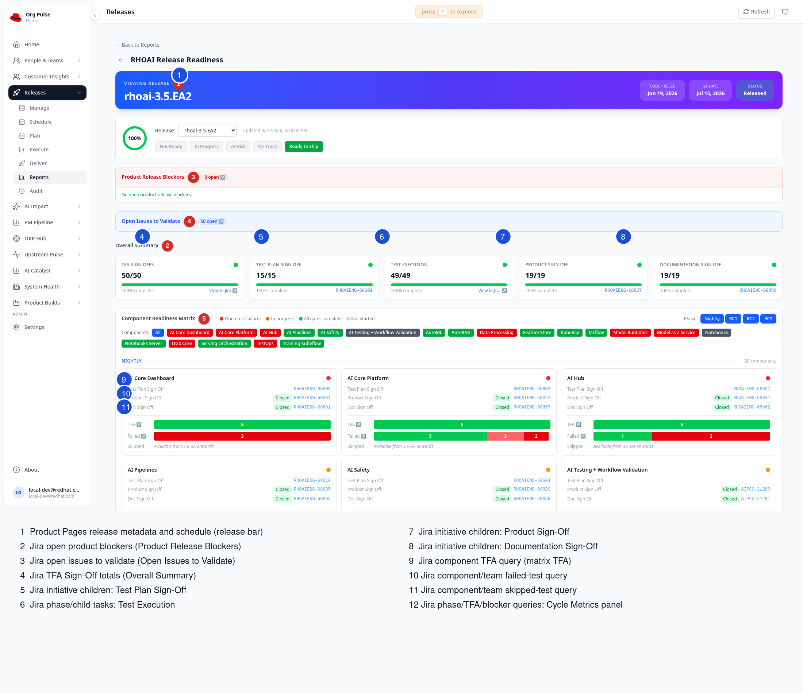

# Release Readiness Dashboard: Sources and UI Coverage

## Dashboard snapshot



## Source conventions

- `RELEASE_VERSION` is the canonical release name, for example `rhoai-3.5.EA2`.
- `JIRA_VERSIONS` may provide exact Jira version names. Otherwise the extractor
  derives candidates and validates them against the `RHOAIENG` project.
- For EA2, the version clause is:

  ```jql
  (fixVersion IN ('rhoai-3.5.EA2', '3.5 EA2 RHOAI RELEASE')
   OR affectedVersion IN ('rhoai-3.5.EA2', '3.5 EA2 RHOAI RELEASE')
   OR 'Target Version' IN ('rhoai-3.5.EA2', '3.5 EA2 RHOAI RELEASE'))
  ```

- `customfield_10001` is Jira's Team field; Team queries require a UUID.
- `customfield_10014` is Jira's legacy Epic Link field.
- Product Pages calls use OIDC client-credentials authentication; no secret
  values belong in this document.

## Product Pages REST queries

The Product Pages client performs these calls:

- Token request:

  ```http
  POST ${TOKEN_ENDPOINT}
  Content-Type: application/x-www-form-urlencoded

  grant_type=client_credentials
  client_id=${OIDC_CLIENT_ID}
  client_secret=${OIDC_CLIENT_SECRET}
  ```

- Release metadata:

  ```http
  GET ${PRODUCT_PAGES_BASE}/releases/${PP_RELEASE_SHORTNAME}/
  Authorization: Bearer <access token>
  ```

  Reads `product_name`, `name`, and `all_ga_tasks` metadata.

- Schedule tasks:

  ```http
  GET ${PRODUCT_PAGES_BASE}/releases/${PP_RELEASE_SHORTNAME}/schedule-tasks/
  Authorization: Bearer <access token>
  ```

  The extractor derives the label `3.5 EA2` from `rhoai-3.5.EA2`, then scans
  task `name`, `flags`, `date_start`, and `date_finish`:

  - GA: task name contains `3.5 EA2`, flag `ga`, and `RHOAI`; fallback name
    contains `3.5 EA2` and `RHOAI RELEASE`.
  - Code freeze: name contains `3.5 EA2 RHOAI Code Freeze`; fallbacks are
    `RHOAI Feature Freeze`, then `AIPCC Code Freeze`.
  - RC1 build: name contains `3.5 EA2` and `RC1`.
  - RC2 build: name contains `3.5 EA2` and `RC2`.

  The selected date is the later of `date_start` and `date_finish`; if only one
  exists, that one is used.

- If Product Pages is unavailable or has no code-freeze date, code freeze falls
  back to `jira/jira-release-variables-3.5.0-ea2.yaml`, reading
  `code_freeze_date`.

## Executed Jira JQL

### 1. Release Activities Initiatives

- Function: `fetch_initiatives()`
- JQL:

  ```jql
  issuetype = Initiative
  AND <VERSION_CLAUSE>
  AND summary ~ "release activities"
  AND status NOT IN (Cancelled)
  ```

- Gets release-activities Initiatives. Returned fields include summary, status,
  issue type, links, parent, labels, components, and Epic Link.
- Feeds: overall summary, gate status, component matrix, phase data, blockers,
  and linked TFA/blocker discovery.

### 2. Initiative/Epic children

- Function: `fetch_children(parent_key)`
- JQL:

  ```jql
  parent = <PARENT_KEY>
  OR "customfield_10014" = <PARENT_KEY>
  ```

- Gets direct children through either Jira's `parent` relationship or legacy
  Epic Link. Used for initiative children, sign-off tasks, and test-phase tasks.

### 3. Linked TFA or blocker issues

- Function: `fetch_issues_by_keys()`
- JQL:

  ```jql
  key IN (<ISSUE_KEY_1>, <ISSUE_KEY_2>, ...)
  ```

- Gets the full issue records for issues discovered through links or TFA labels.
- Python then keeps TFA issues with status `In Review` and blockers whose status
  category is not `Done`.

### 4. Component TFA counts

- Function: `fetch_component_readiness()`
- JQL:

  ```jql
  project = RHOAIENG
  AND component = "<COMPONENT>"
  AND <VERSION_CLAUSE>
  AND summary ~ "TFA Sign-Off"
  AND issuetype NOT IN (Epic, Initiative)
  ```

- Requests `status` and counts New, In Progress, and Done tasks.
- Feeds each matrix tile's TFA bar and open-TFA count.

### 5. Failed test counts by component/team

- Function: `fetch_component_readiness()`
- Mapped component JQL:

  ```jql
  project = RHOAIENG
  AND Team = "<TEAM_UUID>"
  AND <VERSION_CLAUSE>
  AND labels = "test-failed"
  ```

- Unmapped component JQL:

  ```jql
  project = RHOAIENG
  AND component = "<COMPONENT>"
  AND <VERSION_CLAUSE>
  AND labels = "test-failed"
  ```

- Requests `status`; feeds each matrix tile's Failed bar and status breakdown.

### 6. Skipped test counts by component/team

- Mapped component JQL:

  ```jql
  project = RHOAIENG
  AND Team = "<TEAM_UUID>"
  AND <VERSION_CLAUSE>
  AND labels = "test-skipped"
  ```

- Unmapped component JQL:

  ```jql
  project = RHOAIENG
  AND component = "<COMPONENT>"
  AND <VERSION_CLAUSE>
  AND labels = "test-skipped"
  ```

- Feeds each matrix tile's Skipped bar. The frontend intentionally displays
  `Available from 3.6 GA onwards` when `skipped_enabled` is false.

### 7. Open product blockers

- Function: `_build_blocker_base_jql()` / `fetch_product_blockers()`
- JQL:

  ```jql
  project in (RHAIENG, RHOAIENG)
  AND (labels not in (RHOAI-releases, RHOAI-internal, devtestops-service, test-failed, test-skipped)
       OR labels IS EMPTY)
  AND (component not in (Documentation, PXE) OR component is EMPTY)
  AND status not in (Closed, Resolved)
  AND ('Release Blocker' != Rejected OR 'Release Blocker' is EMPTY)
  AND <VERSION_CLAUSE>
  AND priority in (Blocker)
  ```

- Gets open blocker issues and returns key, summary, status, status category,
  and component grouping.
- Feeds the Product Release Blockers count and per-component cards.

### 8. Open issues to validate

- Function: `fetch_open_issues_to_validate()`
- JQL:

  ```jql
  project in (RHAIENG, RHOAIENG)
  AND (labels not in (RHOAI-releases, RHOAI-internal, devtestops-service, test-failed, test-skipped)
       OR labels IS EMPTY)
  AND (component not in (Documentation, PXE) OR component is EMPTY)
  AND status not in (Closed, Resolved)
  AND <VERSION_CLAUSE>
  ```

- Requests `status` and returns the count plus a Jira filter URL.
- Feeds the Open Issues to Validate banner.

### 9. Test-phase Epics for Nightly/RC dates

- Function: `fetch_test_phase_epic_dates()`
- JQL:

  ```jql
  (parent = <INITIATIVE_KEY>
   OR "customfield_10014" = <INITIATIVE_KEY>)
  AND issuetype = Epic
  ```

- Requests `summary`, `status`, `updated`, `resolutiondate`, and `issuetype`.
- Python classifies summaries into Nightly, RC1, RC2, or RC3 and identifies build
  Epics versus test Epics.
- `updated` is used as a test-start proxy; `resolutiondate` (or Done `updated`)
  is used as a completion proxy.
- Feeds the Test Execution Phases accordion and the Jira fallback for cycle
  build dates.

### 10. TFA milestone dates

- Function: `fetch_tfa_milestone_dates()`
- JQL:

  ```jql
  project = RHOAIENG
  AND <VERSION_CLAUSE>
  AND summary ~ "TFA Sign-Off"
  AND issuetype NOT IN (Epic, Initiative)
  ```

- Requests `status` and `updated`.
- If every task is In Progress or Done, the latest `updated` becomes
  `tfas_passed_date`. If every task is Done, the latest `updated` becomes
  `tfas_triaged_date`.
- Feeds both RC1 and RC2 cycle timelines with release-scoped dates.

### 11. Resolved blockers

- First, the extractor executes query 7. If any open blocker is returned,
  `blockers_resolved_date` is `null`.
- If none remain, it executes:

  ```jql
  project in (RHAIENG, RHOAIENG)
  AND (labels not in (RHOAI-releases, RHOAI-internal, devtestops-service, test-failed, test-skipped)
       OR labels IS EMPTY)
  AND (component not in (Documentation, PXE) OR component is EMPTY)
  AND <VERSION_CLAUSE>
  AND priority in (Blocker)
  AND statusCategory = Done
  ```

- Requests `status`, `resolutiondate`, and `updated`; selects the latest
  resolution date, falling back to updated.
- Feeds both RC1 and RC2 cycle timelines.

### 12. TFA totals

- The main flow executes the same TFA JQL as query 10 again, requesting only
  `status`.
- Feeds the Overall Summary `TFA Sign Offs` tile (`done/total`).

## Generated Jira filter links

These queries are embedded in Jira URLs for navigation. They are not all
executed during extraction.

- Overall work:

  ```jql
  (parent IN (<INITIATIVE_KEY_1>, <INITIATIVE_KEY_2>, ...)
   OR "Epic Link" IN (<INITIATIVE_KEY_1>, <INITIATIVE_KEY_2>, ...))
  ```

- Work in progress: overall work plus:

  ```jql
  AND statusCategory = "In Progress"
  ```

- Work done: overall work plus:

  ```jql
  AND statusCategory = "Done"
  ```

- Linked TFA in review:

  ```jql
  key IN (<TFA_KEY_1>, <TFA_KEY_2>, ...)
  AND status = "In Review"
  ```

- Linked blockers open:

  ```jql
  key IN (<BLOCKER_KEY_1>, <BLOCKER_KEY_2>, ...)
  AND statusCategory != Done
  ```

- Component TFA link:

  ```jql
  project = RHOAIENG
  AND component = "<COMPONENT>"
  AND <VERSION_CLAUSE>
  AND summary ~ "TFA Sign-Off"
  ```

- Component failed/skipped links use the corresponding Team/component query from
  queries 5 and 6.

- Per-phase component execution:

  ```jql
  parent = <PHASE_EPIC_KEY>
  AND component = "<COMPONENT>"
  ```

  With multiple phase Epics, `parent =` becomes
  `parent in (<PHASE_EPIC_KEY_1>, <PHASE_EPIC_KEY_2>, ...)`.

- Individual gate link:

  ```jql
  parent = <EPIC_KEY>
  OR "Epic Link" = <EPIC_KEY>
  ```

- Test Execution gate link:

  ```jql
  parent in (<TEST_PHASE_EPIC_KEY_1>, <TEST_PHASE_EPIC_KEY_2>, ...)
  AND issuetype NOT IN (Epic, Initiative)
  ```

- Product blocker per-component links append:

  ```jql
  AND component = "<COMPONENT>"
  ```

## UI coverage

- Release schedule bar:
  - Displays release version, `release_schedule.code_freeze_date`,
    `release_schedule.ga_date`, and `release_schedule.status`.
  - Source: Product Pages, with local YAML code-freeze fallback.
- Product Release Blockers:
  - Displays `product_blockers.total_open` and open component counts.
  - Source: open blocker JQL, with Jira links from generated blocker queries.
- Open Issues to Validate:
  - Displays `open_issues_to_validate.total`.
  - Source: open-validation JQL.
- Overall Summary:
  - Displays TFA Sign Offs, Test Plan Sign Off, Test Execution, Product Sign
    Off, and Documentation Sign Off as `done/total`, percentage, and RAG.
  - Sources: TFA JQL plus initiative child/phase data.
- Component Readiness Matrix:
  - Displays component tiles by Nightly/RC1/RC2/RC3.
  - Each tile displays TFA, Product Sign Off, Documentation Sign Off, TestOps
    execution, failed tests, skipped-test state, and Jira links.
  - Sources: initiative child JQL, component TFA JQL, Team/component failure
    and skipped JQLs, and phase-parent links.
- Test Execution Phases:
  - Displays phase name, done/total, percentage, RAG, and expandable tasks.
  - Source: initiative child JQL and task data returned through child queries.
- Release Cycle Metrics:
  - Displays code freeze, RC1/RC2 build-complete dates, working-day counts,
    test start/finish, TFA milestones, and blocker resolution.
  - Sources: Product Pages plus Jira test-phase/TFA/blocker queries; working-day
    counts are calculated locally.

## Known data caveat

Jira test-phase `updated` timestamps are proxies, not dedicated test-start
timestamps. A later edit can make `test_started_date` later than
`test_finished_date`; the UI currently displays the supplied values rather than
reordering or suppressing them.

Assisted-by: Codex
